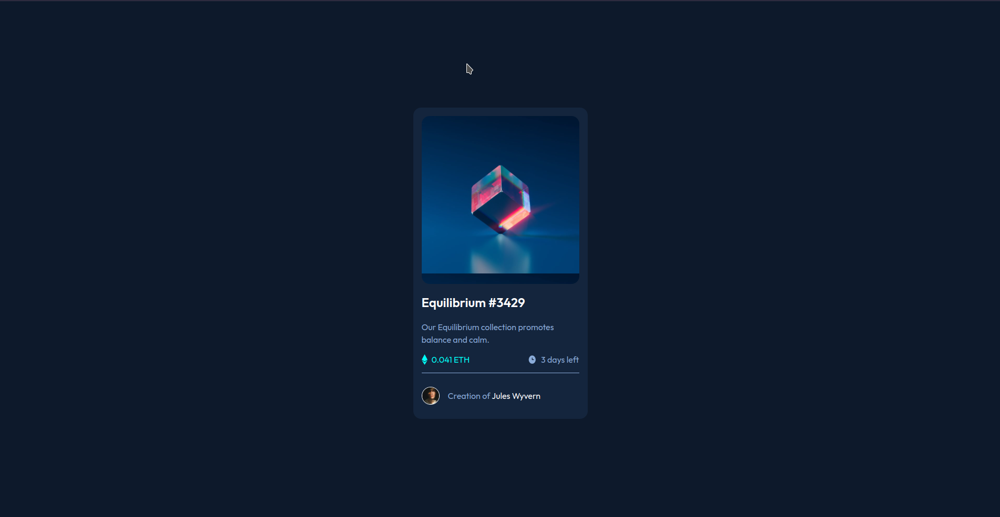

# Frontend Mentor - NFT preview card component solution

This is a solution to the [NFT preview card component challenge on Frontend Mentor](https://www.frontendmentor.io/challenges/nft-preview-card-component-SbdUL_w0U). Frontend Mentor challenges help you improve your coding skills by building realistic projects. 

## Table of contents

- [Overview](#overview)
  - [The challenge](#the-challenge)
  - [Screenshot](#screenshot)
  - [Links](#links)
- [My process](#my-process)
  - [Built with](#built-with)
  - [What I learned](#what-i-learned)
- [Author](#author)

**Note: Delete this note and update the table of contents based on what sections you keep.**

## Overview

### The challenge

Users should be able to:

- View the optimal layout depending on their device's screen size
- See hover states for interactive elements

### Screenshot

Desktop Preview

Mobile Preview

### Links

- Solution URL: [solution URL ](https://github.com/vishnu-31/frontend-mentor-projects/tree/main/nft-preview-card-component-main)
- Live Site URL: [live site URL ](https://vishnu-31.github.io/frontend-mentor-projects/nft-preview-card-component-main/)

## My process

### Built with

- Semantic HTML5 markup
- CSS custom properties
- Flexbox
- Mobile-first workflow

### What I learned

- I learned how to create a layer on the background for hover feedback.

## Author

- Frontend Mentor - [@vishnu-31](https://www.frontendmentor.io/profile/vishnu-31)
- Twitter - [@Vishnu_311](https://twitter.com/Vishnu_311)
