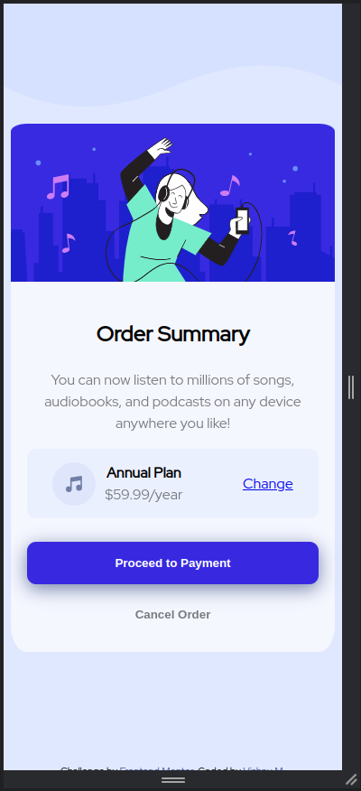

# Frontend Mentor - Order summary card solution

This is a solution to the [Order summary card challenge on Frontend Mentor](https://www.frontendmentor.io/challenges/order-summary-component-QlPmajDUj). Frontend Mentor challenges help you improve your coding skills by building realistic projects.

## Table of contents

- [Overview](#overview)
  - [The challenge](#the-challenge)
  - [Screenshot](#screenshot)
  - [Links](#links)
- [My process](#my-process)
  - [Built with](#built-with)
  - [What I learned](#what-i-learned)
- [Author](#author)

## Overview

### The challenge

Users should be able to:

- See hover states for interactive elements

### Screenshot

Desktop preview

### Links

- Solution URL: [solution URL ](https://github.com/vishnu-31/frontend-mentor-projects/tree/main/order-summary-component-main)
- Live Site URL: [live site URL ](https://vishnu-31.github.io/frontend-mentor-projects/order-summary-component-main/)

## My process

### Built with

- Semantic HTML5 markup
- CSS custom properties
- Flexbox
- Mobile-first workflow

### What I learned

I learned about the pseudo-classes in css.
I learned align things and text vertically.

### Useful resources

- [MDN Web Docs](https://developer.mozilla.org/en-US/docs/Web/CSS) - I refered to the MDN Docs for clarification.

## Author

- Frontend Mentor - [@vishnu-31](https://www.frontendmentor.io/profile/vishnu-31)
- Twitter - [@Vishnu_311](https://twitter.com/Vishnu_311)
