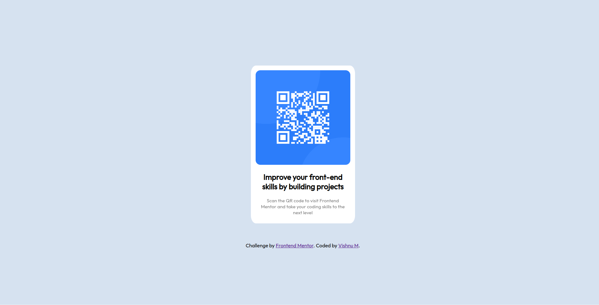

# Frontend Mentor - QR code component solution

This is a solution to the [QR code component challenge on Frontend Mentor](https://www.frontendmentor.io/challenges/qr-code-component-iux_sIO_H). Frontend Mentor challenges help you improve your coding skills by building realistic projects.
## Table of contents

- [Overview](#overview)
  - [Screenshot](#screenshot)
  - [Links](#links)
- [My process](#my-process)
  - [Built with](#built-with)
  - [What I learned](#what-i-learned)
- [Author](#author)

## Overview

### Screenshot

Screenshot of the desktop peview

Screenshot of mobile preview

### Links

- Solution URL: [Click Here](https://github.com/vishnu-31/frontend-mentor-projects/tree/gh-pages/qr-code-component-main)
- Live Site URL: [Click Here](https://vishnu-31.github.io/frontend-mentor-projects/qr-code-component-main/)

## My process

### Built with

- Semantic HTML5 markup
- CSS custom properties
- Flexbox
- Mobile-first workflow

### What I learned

I learned how to arrange different elements in a div on horizontal or vertical order.
I learned how to center a div horizpntally and vertically.
I learned how to center a div vertically using the display:table property.

``

## Author

- Frontend Mentor - [@vishnu-31](https://www.frontendmentor.io/profile/vishnu-31)
- Twitter - [@Vishnu_311](https://twitter.com/Vishnu_311)
